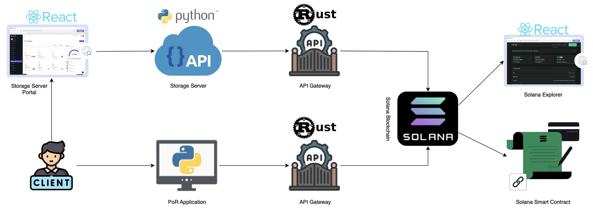

# Proofs of Retrievability

## Applied Cryptography

This project implements a **Proof of Retrievability (PoR) system**, ensuring secure file storage and verification using cryptographic techniques. The system integrates **Reed-Solomon encoding**, **PoR authentication**, and **Solana blockchain-based storage subscriptions** to provide a reliable and decentralized storage solution.

## System Architecture

The project consists of multiple services working together to enable secure storage and retrieval:

- **PoR Application** – Handles encoding, decoding, and PoR-based integrity verification. ([Read more](./PoR_Application/README.md))
- **Storage Server** – Flask-based backend managing file storage and retrieval. ([Read more](./storage_server/README.md))
- **Storage Server Portal** – A GUI for users to manage their stored files. ([Read more](./storage_server_portal/README.md))
- **Solana API Gateway** – Manages interactions with Solana for escrow-based storage subscriptions. ([Read more](./solana_api_gateway_server/README.md))
- **Solana Smart Contracts** – Handles on-chain storage payments and validations. ([Read more](./solana_anchor_smart_contract/README.md))
- **Solana Explorer** – GUI for viewing accounts, programs, and transactions on the Solana blockchain. ([Read more](./solana_explorer/solana_explorer_README.md))

## Service Architecture

Below is the system architecture diagram:



Each component plays a crucial role in ensuring **data integrity, cryptographic proof of retrievability, and secure blockchain-based storage management**.

## PoR Locally Program

The [PoR_locally_program](./PoR_locally_program) directory contains a Python implementation of the Proof of Retrievability (PoR) system for both public and private key-based verification, as described in the referenced research [papers](./Papers/). This program allows running PoR computations locally to validate file integrity and ownership.

## Running an Example

### 1. Generate Keypairs for Buyer and Seller

Generate a keypair using the Solana CLI:
```sh
solana-keygen new --outfile buyer-keypair.json
solana-keygen new --outfile seller-keypair.json
```

The generated keypair is stored as an array in the file path. To retrieve the private key, use the following tool:
[Solana Keypair Converter](https://danielbui12.github.io/solana-keypair-converter/)

### 2. Start Solana Test Validator

Run the Solana test validator as explained in the Solana README.

### 3. Start Required Services

Run each service as explained in its respective README:
- **Solana Explorer Server**
- **Storage Server**
- **Storage Server Portal**
- **Two Solana API Gateway servers** (one for the client PoR app, one for the storage server)

### 4. Fund Player Accounts

Insert the buyer and seller accounts into the Solana blockchain by airdropping SOL:
```sh
solana airdrop 100 <buyer-public-key>
solana airdrop 100 <seller-public-key>
```
Example:
```sh
solana airdrop 1000 B7i7AnjW7sU5dUQqyuJCYaFPQ8tcFEhdLToQeDtaRk88
```

### 5. Deploy Solana Smart Contract

Deploy the Solana smart contract as explained in the smart contract sub-project README.

### 6. Run PoR Application

1. Open the PoR application.
2. Encode a file.
3. Navigate to the Solana page and generate a subscription by adding the encoded file parameters to the subscription details.
4. The application will return a **subscription escrow account**.

### 7. Fund the Escrow Account

Go to "Add Funds" in the PoR application and transfer funds to the escrow account.

### 8. Upload File to Storage Server

1. Open the Storage Server Portal.
2. Upload the encoded file to the server.

### 9. Proof of Storage

Once uploaded, the storage server will periodically send proof to the Solana smart contract for validation at the interval specified in the subscription escrow account.

### 10. File Retrieval

While the server holds the file, the client can download the uploaded file from the Storage Server Portal.

### 11. End Subscription

1. The client can end the subscription through the PoR application.
2. Once the subscription ends, the client can delete the file from the Storage Server Portal.

## Useful Links

**PoR Project Report:** [Project Report](./docs/proofs_of_retrievability_report.pdf)

**Solana SOL to Lamports Converter:** [SOL Converter](https://sol-converter.vercel.app/)

**Solana Keypair Converter:** [Keypair Converter](https://danielbui12.github.io/solana-keypair-converter/)